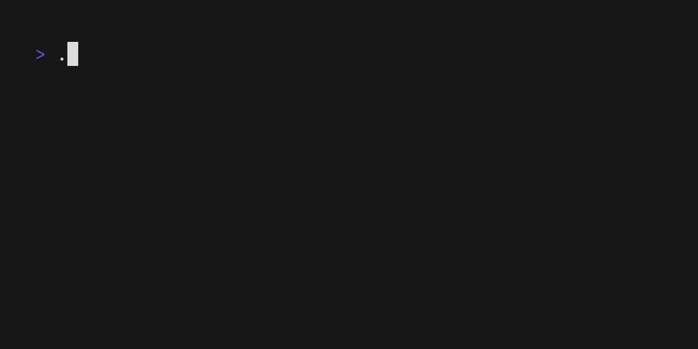
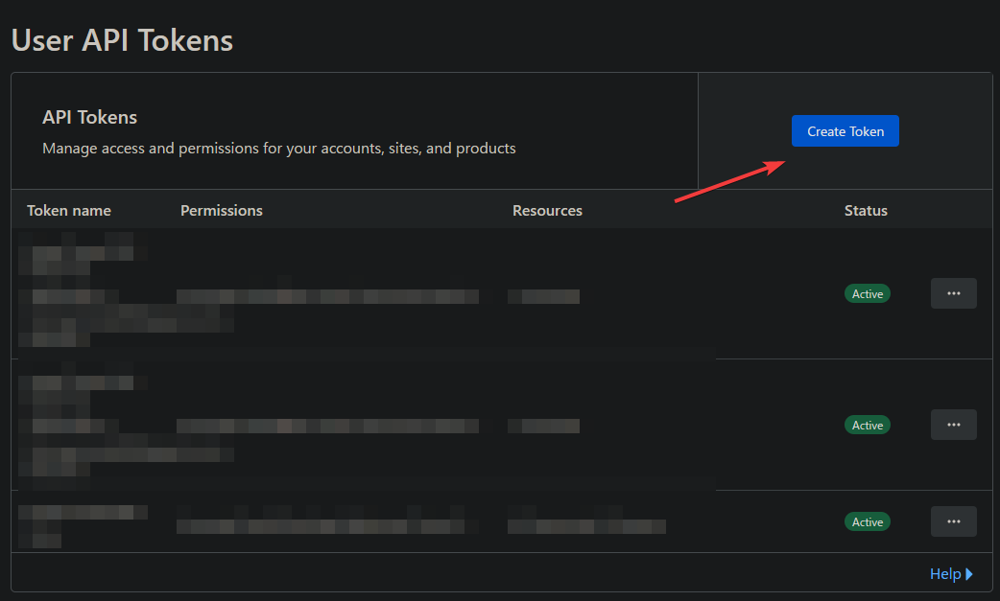
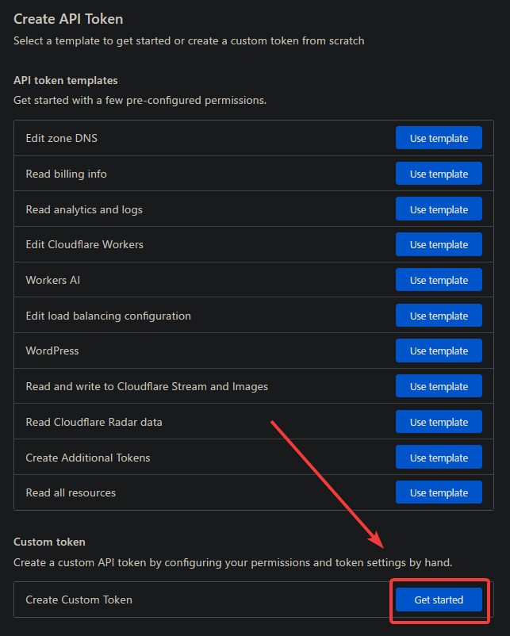
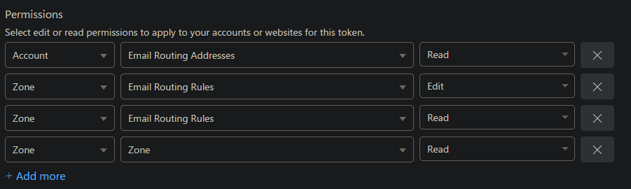

# Soramail


**Soramail** is a Terminal User Interface (TUI) application that allows you to efficiently generate and manage forwarded email addresses using [Cloudflare Email Routing](https://www.cloudflare.com/products/email-routing/).

With Soramail, you can quickly create forwarded email rules and reduce spam emails without navigating through the Cloudflare web interface. It's fast, intuitive, and designed for developers who prefer working within the terminal.

## Features

- **Multiple Zones**: Select from different domains configured in your Cloudflare account.
- **High Performance**: Built with Go and the Bubbletea framework for a smooth, fast TUI experience.

## Why?
- **Protect Your Email Address**: Don't provide companies with your real email address. Hide behind your own domain
- **Disposable**: Getting spam emails? Just dispose the email since it's not a catch-all address!
- **Free**: Cloudflare Email Routing is free and without any limits to my knowledge.

## Installation

### Prerequisites

- Go (latest version)
- Cloudflare API Token with appropriate permissions for Email Routing

#### Setting up Cloudflare API Token
1. Visit [Cloudflare User API Tokens](https://dash.cloudflare.com/profile/api-tokens)
2. Click on create token

3. Click on 'Get Started' on the custom token section

4. Enter a name for the token and input these recommended permissions

5. Configure the account resources and zone resources to grant to the app. Leave it as 'All' if unsure.
6. Finish token creation and save your token somewhere.

### Install Soramail

#### With Go Install (recommended)

```bash
go install github.com/provsalt/soramail@latest
```

#### Manually

Clone the repository and build the binary:

```bash
git clone https://github.com/yourusername/soramail.git
cd soramail
go build -o soramail
```

Move the binary to a location in your PATH:

```bash
sudo mv soramail /usr/local/bin/
```

## Configuration
When you run soramail for the first time, it should guide you through the setup wizard. 

If you need to change any of the settings, you can configure them at `~/.config/soramail` or `%LOCALAPPDATA%\soramail` (for windows)

## Usage

- **Navigate** through the TUI using arrow keys or using `j` and `k` keys.
- **Select** options with `Enter` or `l`.
- **Backtrack** by pressing `h` or `esc`.
- **Quit** at any time with `Ctrl+C` or `q`.


## Contributing

Contributions are welcome! Please open an issue or submit a pull request with improvements or bug fixes.

### Planned features
- Managing of email forwarding rules.
- Settings for configuring API key and randomize function.
- Colours using lipgloss

## License

This project is licensed under the GPLv3 License. See the [LICENSE](./LICENSE) file for details.

## Acknowledgments

- [Bubbletea](https://github.com/charmbracelet/bubbletea) for the TUI framework (thanks for sending over stickers awhile back!)
- Cloudflare for their powerful Email Routing service

Happy mailing! ✉️